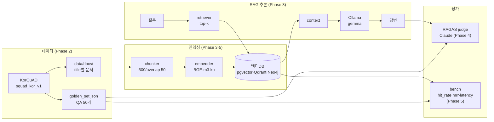

# rag-eval-kit

RAGAS로 RAG 파이프라인 품질을 측정하고, **pgvector / Qdrant / Neo4j** 벡터DB와 임베딩 모델을 비교 벤치마크하는 키트.

## 목적

- KorQuAD(`squad_kor_v1`) 기반 한국어 골든셋으로 RAG 파이프라인 구성
- RAGAS 4대 지표(`faithfulness`, `answer_relevancy`, `context_precision`, `context_recall`)로 품질 평가
- 동일 조건에서 벡터DB 3종 / 임베딩 3종을 latency·정확도 기준으로 비교

## 기술 스택

| 역할           | 선택                                                        |
| -------------- | ----------------------------------------------------------- |
| 데이터셋       | `KorQuAD/squad_kor_v1` (HuggingFace)                        |
| RAG 추론 LLM   | Ollama — `gemma4-e2b` (로컬)                                |
| RAGAS 평가 LLM | `langchain-anthropic` — Claude (API)                        |
| 임베딩         | Qwen3-Embedding-0.6B / embeddingGemma / dragonkue/BGE-m3-ko |
| 벡터DB         | pgvector / Qdrant / Neo4j                                   |

## 아키텍처



## 빠른 시작

```bash
# 1. 환경 변수 준비
cp .env.example .env
# .env 에 ANTHROPIC_API_KEY 입력

# 2. 벡터DB 컨테이너 실행 (pgvector / Qdrant / Neo4j)
docker compose up -d
docker compose ps        # 모두 healthy 확인

# 3. Python 의존성 설치
uv sync                  # 또는: pip install -e ".[dev]"

# 4. Ollama 모델 준비 (로컬 추론 LLM)
ollama pull gemma4:e2b

# 5. 단위 디버깅은 노트북에서
jupyter lab
```

### 주피터를 컨테이너로 띄우려면 (선택)

호스트에 Python 환경을 만들지 않고 `Dockerfile` 이미지로 주피터를 실행한다.
기본 `up`에는 안 뜨고 `notebook` 프로파일일 때만 함께 뜬다 (DB는 서비스명, Ollama는 호스트로 접속).

```bash
docker compose --profile notebook up -d --build
# → http://localhost:8888  (로컬용이라 토큰 없음)
```

### 무거운 작업은 스크립트로

주요 로직은 `src/` 모듈로 분리되어 있어 노트북에서 `from src.xxx import ...`로 단위 확인하고,
1,000건이 넘는 임베딩 적재 같은 대량 작업은 스크립트로 실행한다 (tqdm 진행도 표시).

```bash
# 전체 코퍼스(1,417개) 청킹·임베딩·pgvector 적재 — 진짜 baseline용
python scripts/index_corpus.py
python scripts/index_corpus.py --max-docs 200   # 빠른 동작 확인용

# 골든셋 RAG 추론 수집 → results/eval_inputs.json
python scripts/collect_eval_inputs.py

# RAGAS 4개 지표 평가 (수집 + 평가 한 번에: --collect)
python scripts/run_ragas_eval.py --collect
```

### 접속 정보

| 서비스   | 주소                            | 계정                    |
| -------- | ------------------------------- | ----------------------- |
| pgvector | `localhost:5432`                | `rag` / `rag`           |
| Qdrant   | http://localhost:6333/dashboard | -                       |
| Neo4j    | http://localhost:7474           | `neo4j` / `ragpassword` |

## 디렉토리 구조

```
rag-eval-kit/
├── data/
│   ├── docs/               # title별 텍스트 파일 (squad_kor_v1 가공)
│   └── golden_set.json     # QA 골든셋 50개
├── notebooks/              # 단위 디버깅 — src 함수를 단계별로 호출
│   ├── 00_dataset_prep.ipynb   # 데이터 가공 및 골든셋 추출
│   ├── 01_pipeline.ipynb       # RAG 파이프라인 구성 (소량 확인)
│   ├── 02_ragas_eval.ipynb     # RAGAS 평가
│   └── 03_vectordb_bench.ipynb # 벡터DB·임베딩 벤치마크
├── src/                    # 재사용 모듈 (editable 설치 → from src.x import)
│   ├── config.py               # 경로·하이퍼파라미터·접속정보 (cwd 독립)
│   ├── dataset.py              # KorQuAD 로드 → dedup → docs / 골든셋
│   ├── chunker.py              # 문서 로드 & 청킹
│   ├── embedder.py             # 임베딩 모델 (device 자동)
│   ├── retriever.py            # pgvector 엔진/적재/리트리버
│   ├── rag.py                  # LCEL RAG 체인
│   └── evaluator.py            # RAGAS 셰임/judge/수집/평가
├── scripts/                # 대량/무거운 작업 CLI (tqdm 진행도)
│   ├── index_corpus.py         # 전체 코퍼스 임베딩·적재
│   ├── collect_eval_inputs.py  # 골든셋 RAG 추론 수집
│   └── run_ragas_eval.py       # RAGAS 평가 실행
├── results/                # 평가·벤치 산출물 (json/csv)
├── .github/workflows/ci.yml  # ruff lint + 구문 스모크
├── docker-compose.yml      # 벡터DB 3종 + (opt-in) 주피터
├── Dockerfile              # 주피터 서버 이미지
├── pyproject.toml
└── README.md
```

## 평가 결과

골든셋 50개 × 풀 파이프라인(BGE-m3-ko → pgvector → Ollama gemma) 기준, Claude judge 평가.

| faithfulness | answer_relevancy | context_precision | context_recall |
| :----------: | :--------------: | :---------------: | :------------: |
|    0.823     |      0.334       |       0.938       |     0.940      |

- **검색(context) 품질은 우수** — precision/recall 0.94 수준으로 관련 문맥을 잘 가져온다.
- **faithfulness 0.82** — 생성 답변이 대체로 문맥에 충실하다(환각 적음).
- **answer_relevancy 0.33은 "병목"이 아니라 지표·데이터셋 특성의 아티팩트로 본다.**
  - RAGAS `answer_relevancy`는 정답(reference)을 쓰지 않는다.
  - 생성 답변에서 LLM이 **역으로 질문을 만들고**, 그 질문과 원 질문의 **임베딩 코사인 유사도**를 점수로 쓴다 (`score = cosine_sim.mean()`, [`_answer_relevance.py`](.venv/lib/python3.12/site-packages/ragas/metrics/_answer_relevance.py)).
  - 본 골든셋은 KorQuAD 기반이라 정답이 단답(스팬)이고, RAG 프롬프트도 "간결히 답하라"고 지시한다 ([`src/rag.py`](src/rag.py)).
  - 그 결과 답변이 "프랑스"·"임오군란"처럼 짧으면, 거기서 되돌린 질문이 두루뭉술해져("어느 나라인가?") 구체적인 원 질문("크리스티앙 디오르가 태어난 국가는?")과 닮은 정도가 떨어진다.
  - 실제로 gemma가 "모르겠다"고 넘어간 답변은 0건이고, 살펴본 답변은 모두 정답과 일치했다.
  - 그런데도 점수는 낮았고, **답이 짧을수록 점수가 낮고 길수록 높았다** (≤10자 0.26 → >50자 0.44).
  - 즉 **답이 틀려서가 아니라 짧아서** 깎인 점수다.
- **시사점**
  - 따라서 "추론 LLM 업그레이드"가 자명한 다음 수가 아니다 — 답변이 여전히 단답이면 AR은 안 오른다.
  - 단답 추출형 QA에는 정답 대조형 지표(`answer_correctness`/EM·F1)가 더 타당하다.
  - AR을 쓰려면 답변을 완결된 문장으로 내도록 프롬프트를 바꿔 측정 조건을 맞추는 편이 낫다.

## 벤치마크 결과

> 검색 품질 지표는 judge LLM의 비용·변동성을 피해 **결정론적 `hit_rate@4` / `mrr@4`**를 쓴다
> (정답 스팬 substring 포함 여부, `src/retrieval_metrics.py`). 골든셋 50개 쿼리, 코퍼스 13,808 청크.

### Round 1 — DB 3종 비교 (임베딩 고정: `dragonkue/BGE-m3-ko`)

| DB            | 인덱싱(s) | latency p50 / p95 (ms) | hit_rate@4 |   mrr@4   |
| ------------- | :-------: | :--------------------: | :--------: | :-------: |
| **Qdrant** ✅ |  **6.9**  |     **2.5 / 9.5**      |    0.96    |   0.917   |
| pgvector      |   20.2    |      30.4 / 34.3       |  **0.98**  | **0.937** |
| Neo4j         |   14.9    |       5.1 / 8.8        |    0.88    |   0.823   |

- **속도는 Qdrant 압승** — 검색 p50이 pgvector의 ~1/12, 인덱싱도 3배 빠름.
- 품질은 pgvector가 근소 1위지만 골든셋 n=50이라 **1문항 = 2%p**, pgvector↔Qdrant 차이는 사실상 동률. 반면 Neo4j(0.88)는 유의미하게 낮음(ANN recall 열위).
- → **종합 1위 Qdrant** (품질 동률 + 속도 우위). Round 2의 고정 DB로 채택.

### Round 2 — 임베딩 3종 비교 (DB 고정: Qdrant)

| 임베딩               | dim  | 임베딩 생성(s) | hit_rate@4 |   mrr@4   |
| -------------------- | :--: | :------------: | :--------: | :-------: |
| **BGE-m3-ko** ✅     | 1024 |      1133      |  **0.98**  | **0.937** |
| embeddinggemma-300m  | 768  |    **699**     |    0.82    |   0.743   |
| Qwen3-Embedding-0.6B | 1024 |      1940      |    0.76    |   0.678   |

- **BGE-m3-ko 완승** — 한국어 파인튜닝 모델답게 품질이 한 체급 위.
- embeddinggemma는 **최속·768차원(저장 25%↓)**의 가성비 대안. Qwen3-0.6B는 품질·속도 모두 열위.

### 권장 조합

**Qdrant + dragonkue/BGE-m3-ko** — 품질 최상위 + 검색/인덱싱 속도 우위로 운영 부담 최소.

### 신뢰도 메모

- **재현성:** 동일 `(Qdrant, BGE-m3-ko)`가 Round 1=0.96, Round 2=0.98로 흔들림 → ANN 비결정성/시드 미고정. ±0.02 노이즈 밴드로 해석.
- **표본:** n=50 → 4%p 미만 차이는 노이즈(동률로 본다).
- **latency:** 단일 스레드 순차 측정 50샘플, 로컬 기준. 동시 부하(throughput)는 별도 과제.
